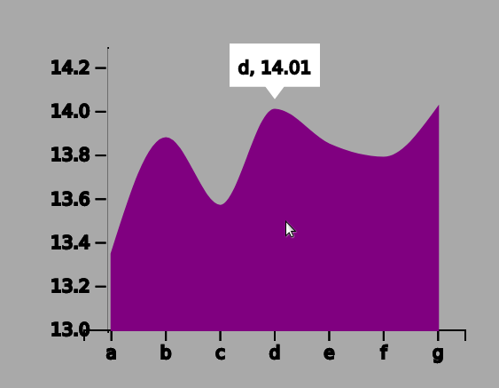
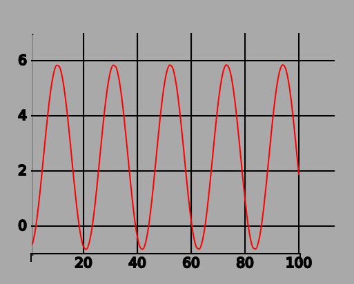

# Prettifying Guide for Designers/Developers

This tutorial discusses the control of critical parts of chart, such as ticks and labels.

## Ticks Control

Ticks can be critical part of a figure. 
Sdatch supports two ways to specify ticks in `FigConfig` object.

### 1. Render ticks with FSR

The simplest way to enable tick is using FSR. If you have data:

```javascript
[13.3518, 13.8825, 13.5789, 14.019, 13.8530, 13.7918, 14.0238]
```

You can specify pretty area chart by a FigConfig object

```javascript
{
        id: "p5area",
        type: "area",
        column: ["a","b","c","d","e","f","g"],
        focus: {
          y: [13.000,14.250]
        },
        data: [13.3518, 13.8825, 13.5789, 14.019, 13.8530, 13.7918, 14.0238],
        axe: {
            x: true,
            y: true,
        },
        smooth: true,
        round: 2,
        color: {
            stroke: "purple",
            fill: "purple"
        },
    }
```

Here you only specify tick information about its **focus**, that means minimal and max value of y ticks.
Without any other options, your area chart already has x and y ticks in sense.



If you do not specify `FigConfig.focus`, y ticks is started at zero and ended at the optimized value above the max datum.
Also if you do not specify `FigConfig.round`, label values are not rounded at 10^-2 order.


### 2. Specify ticks with an array

In some cases you need to set specific values in ticks. 
Think your data is in wave form like sin or cos curve, 




In this chart, x ticks are manually specified, however default FSR can set discrete ticks values for all data (unreadable).
You can specify x ticks values in `FigConfig` object like this:

```javascript
{
    id: "wave", 
    type: "line", 
    smooth: true,
    data: getWaveData(),
    ticks: { 
        x: {
            inner: true, 
            values: [20,40,60,80,100]
        }, 
        y: { inner: true} 
    },
    color: {
        stroke: "red"
    },
    axe: { x:true, y: true },
    plot: false
}
```

Here `FigConfig.ticks.x.values` represents an array of ticks on x axe.

### 3. Unsafe chart for manual customization

You can disable FSR and get advanced manual operation for chart layouts.
To disable FSR and unlock unsafe chart , `FigConfig.safe` must be set to `false`:

```javascript
{
    id: "wave", 
    type: "line", 
    smooth: true,
    margin: {x: 50, y: 100},
    area: {x: 200, y: 200},
    data: getWaveData(),
    ticks: { 
        x: {
            inner: true, 
            values: [10,20,30,40,50]
        }, 
        y: {
            inner: true
        }
    },
    color: {
        stroke: "red"
    },
    round: 5,
    axe: { x:true, y: true},
    plot: false,
    safe: false
}
```

You can draw curve within a layer you specify its size and margin on your hand, without any automatic adjustment by FSR.

This feature is useful when a chart with several layers must fit to specific requirement on special UI quality.